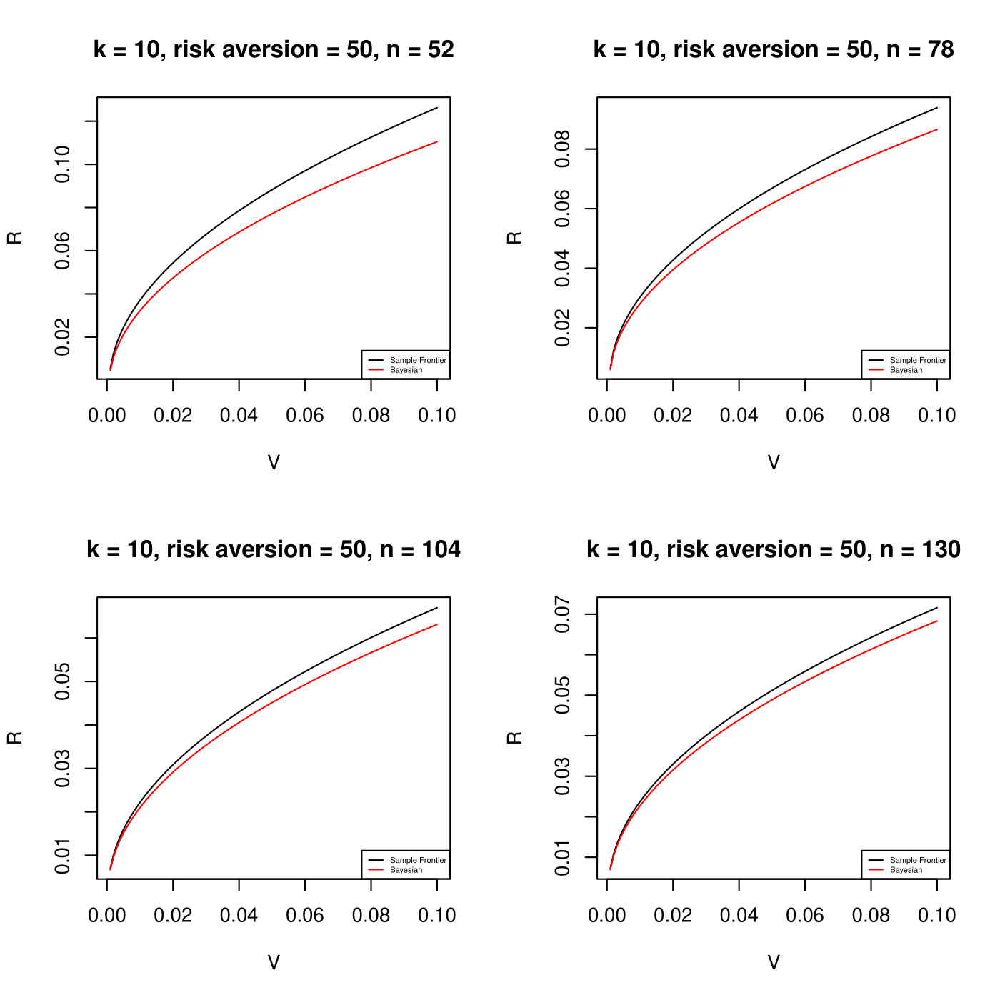

# Mean-variance analysis project

Goal is to replicate some results from a paper via simulation and real world data. Still in progress.

## Usage

Make sure primary.R and functions.R are in the same directory.
```
Rscript primary.R
```
The output is a pdf of plots Rplots.pdf 

## Sample Output



## Authors

- [@jw8u](https://www.github.com/jw8u)
